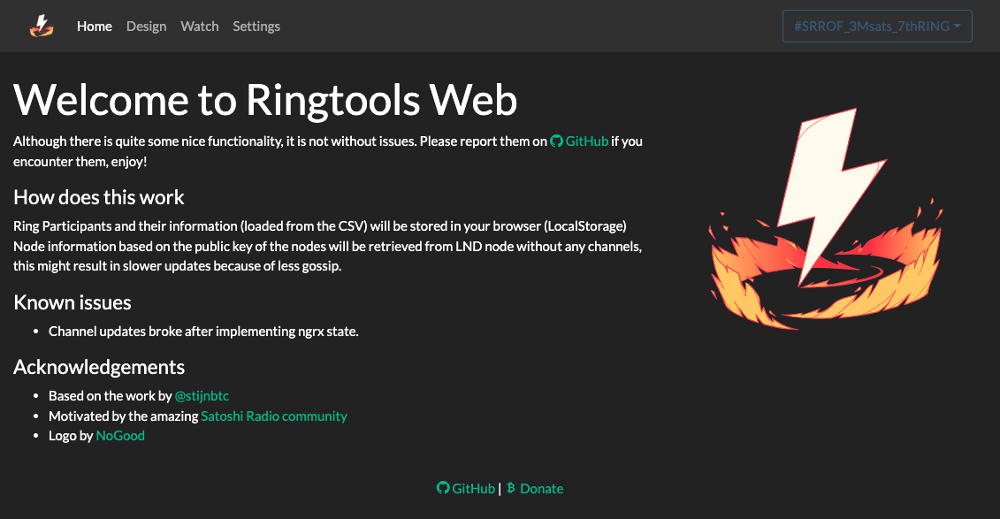

# RingTools

````{toctree}
:caption: RingTools-CLI
:hidden: true
ringtools-cli.md
````
````{toctree}
---
caption: RingTools-web
hidden: true
maxdepth: 1
---
ringtools-web-public.md
````
````{toctree}
---
caption: Telegram-bot
maxdepth: 1
hidden: true
---
tg/overview.md
tg/participate.md
tg/convenience.md
tg/admins.md
````
````{toctree}
---
caption: Rings of Fire
maxdepth: 1
hidden: true
---
faq.md
````
````{toctree}
---
caption: Links
maxdepth: 1
hidden: true
---
Satoshi Radio <https://t.me/satoshiradio>
Satoshi Radio ROF <https://t.me/SatoshiRadioROF>
Connect the World <https://t.me/connect_the_world>
````

A set of tools which help to set up and manage Rings of Fire, a concept of Bitcoin Lightning Networks.


