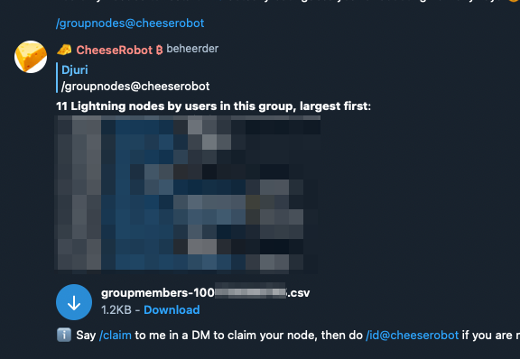
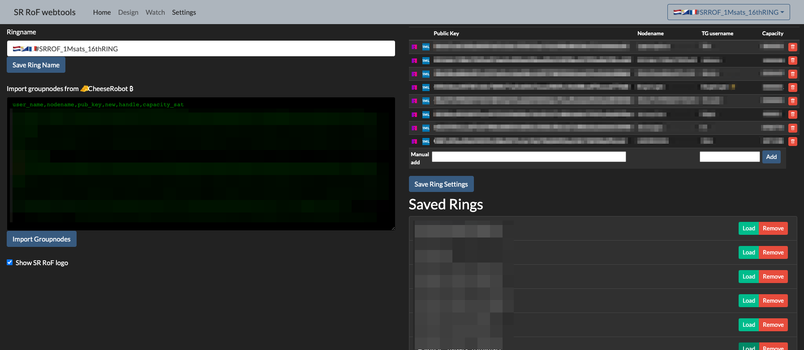

# Public instance

There is a public instance available at [rof.tools](https://rof.tools). Although it does have channels, it is probably not part of the Ring of Fire you are leading or participating in so gossip might be slower.

## Manual import node information from Cheeserobot

- Make sure Cheeserobot is in the ring channel
- Say `/groupnodes@cheeserobot`

- Download the `.csv` file
- Open it in a text editor (don't open it in a spreadsheet like Excel or Numbers)
- Select all and copy to clipboard, including headers.
- Go to the settings page of [Ringtools-Web](https://rof.tools/settings)
- Paste the clipboard contents to the Import area.

- Press `Import Groupnodes` button. 
- You should now see the node information on the right side.
- Set a Ringname
- Click `Save Ring Settings` to persist to the browsers localstorage
- You are now ready to use the `Design` and `Watch` parts of `Ringtools-Web`